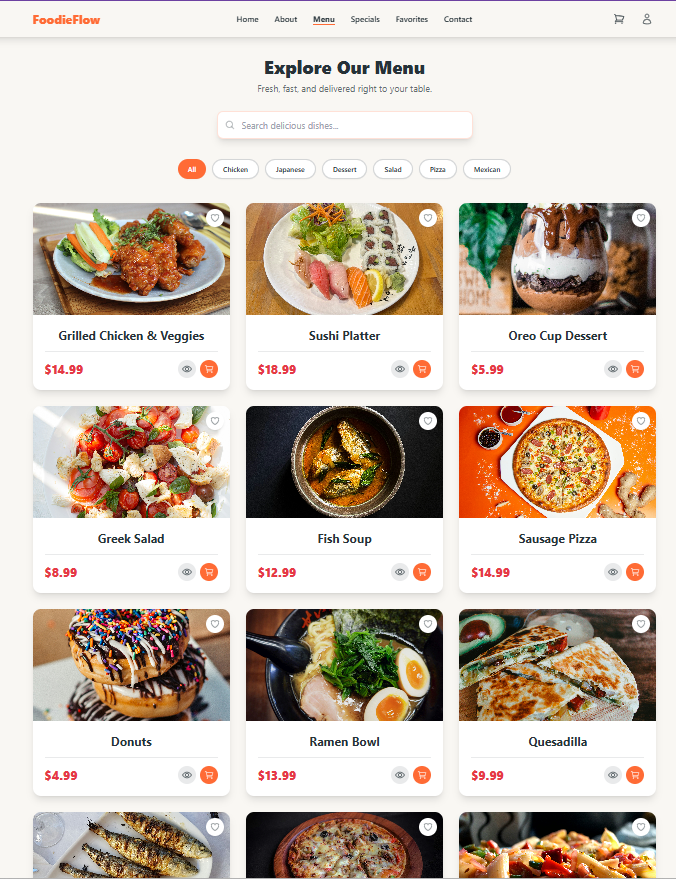
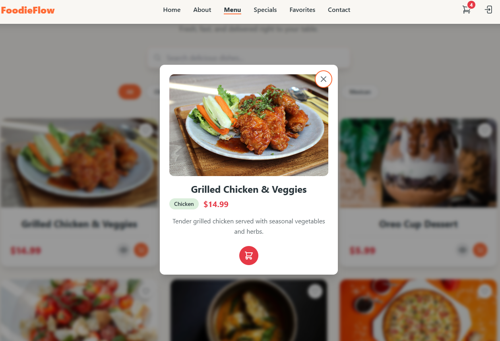
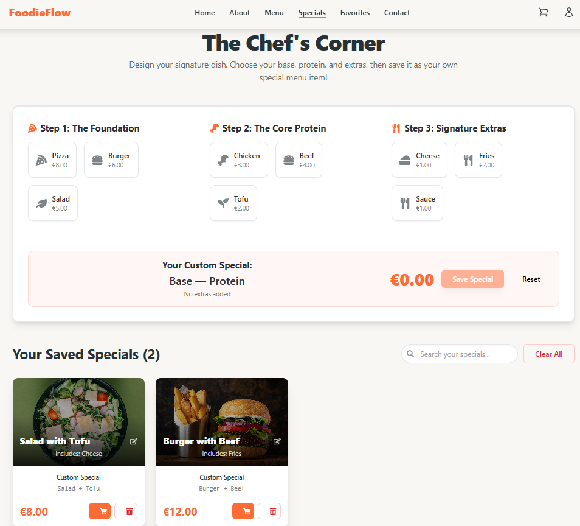
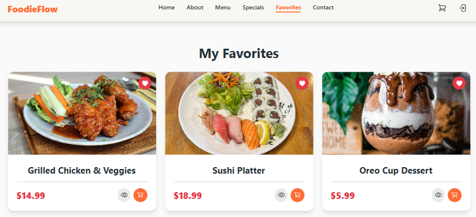
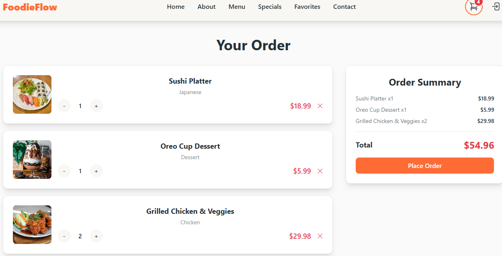
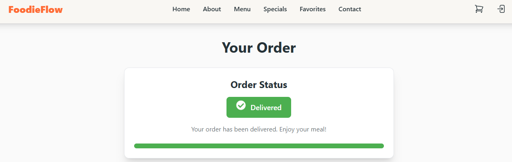
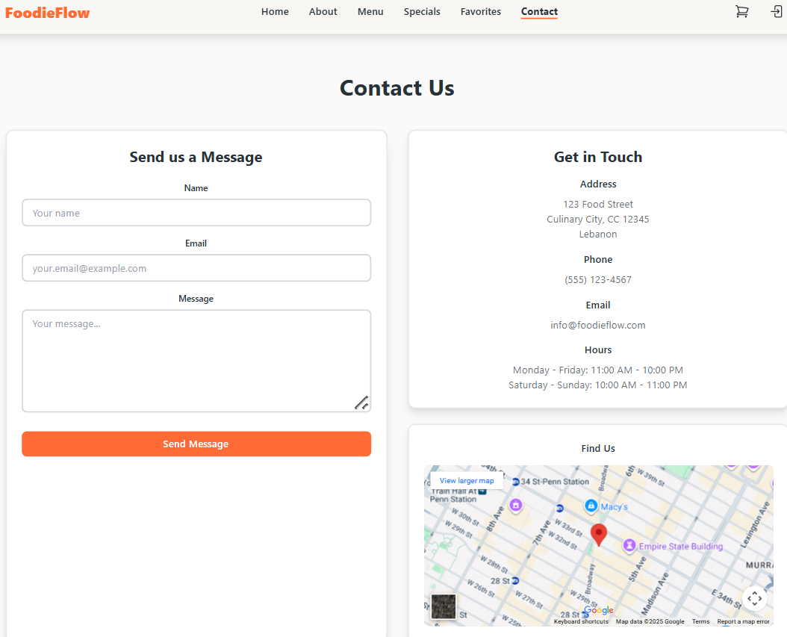
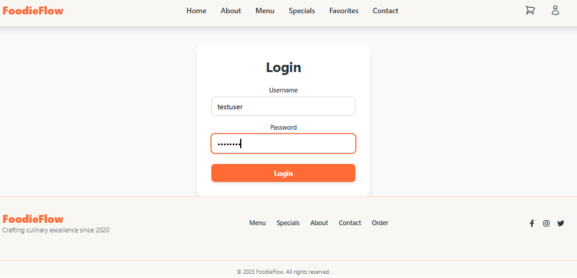

# FoodieFlow — Restaurant Ordering Web App

FoodieFlow is a responsive React-based web application designed to simplify restaurant ordering.  
Users can browse the menu, view specials, manage favorites, and place orders with a clean and modern UI.

---

## Live Demo
View the app on GitHub Pages: (https://haningit11.github.io/foodie-flow-restaurant-ordering)

#### test using this credentials:
username = testuser
password = password

---

## Project Description
This project was developed as part of **CSCI426 — Advanced Web Programming (Phase 1: Frontend)**.  
It demonstrates:
- Component-based design with ReactJS
- State management using Context API
- Routing with React Router (HashRouter for GitHub Pages compatibility)
- Responsive styling with Tailwind CSS
- Iconography with React Icons
- Toast notifications with React Hot Toast
- Deployment using GitHub Pages

---

## Technologies Used
- ReactJS  
- React Router (HashRouter)  
- Context API  
- Tailwind CSS  
- React Icons  
- React Hot Toast  
- Git & GitHub  
- GitHub Pages  

---
## 📸 UI Screenshots

| Home Page | Menu Page | Menu Modal |
|-----------|-----------|------------|
|  |  |  |

| Specials Page | Favorites | Orders |
|---------------|-----------|--------|
|  |  |  |

| Order Status | Contact Page | About Page |
|--------------|--------------|------------|
|  |  |  |

| Login Page |
|------------|
|  |

---

## Setup Instructions

Clone the repository and install dependencies:

```bash
git clone https://github.com/haningit11/foodie-flow-restaurant-ordering.git
cd foodie-flow-restaurant-ordering
npm install

To run the development server:
npm start

Build for production:
npm run build

Deploy to GitHub Pages:
npm run deploy


 
